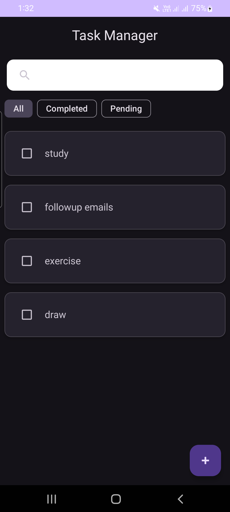
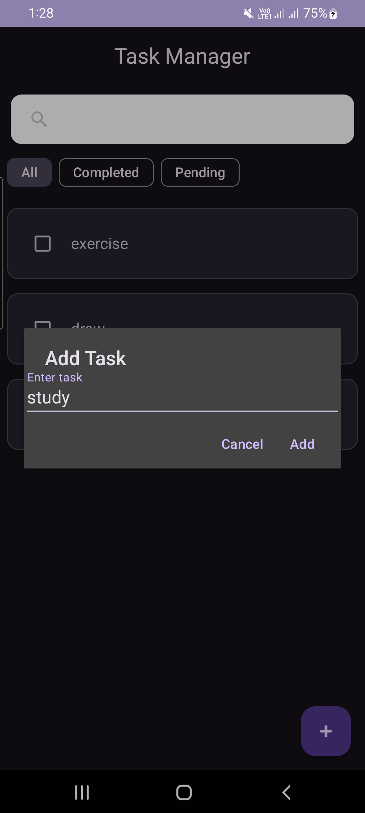
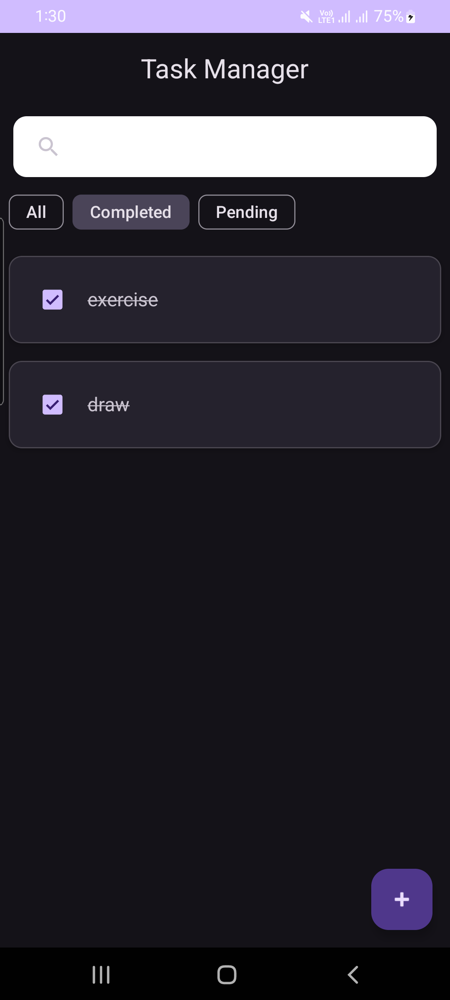
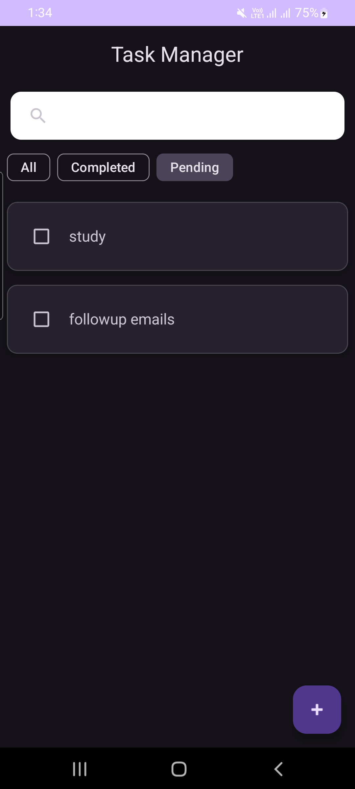
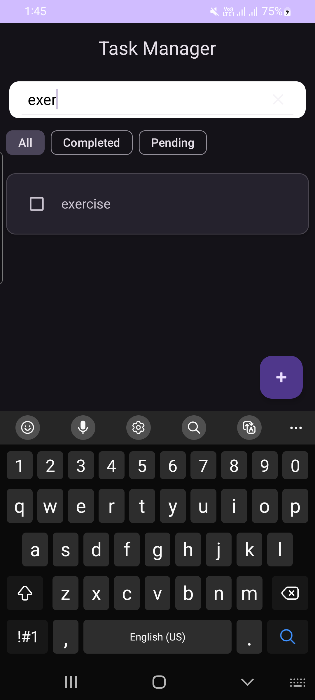

# Task Manager App (Android)

A simple and clean **offline-first To-Do application** built using modern Android development practices.  
The app allows users to manage daily tasks with local persistence and optional cloud backup.

---

## ✨ Features

- Add, edit, and delete tasks
- Mark tasks as completed (strike-through effect)
- Filter tasks:
    - All
    - Completed
    - Pending
- Real-time search
- Swipe to delete with **Undo**
- Offline-first using Room database
- Cloud backup & sync using Firebase Firestore
- Lifecycle-aware UI updates

---

## 🏗️ Architecture

The app follows **MVVM (Model–View–ViewModel)** architecture:

- **UI**: Activity + RecyclerView
- **ViewModel**: Handles UI state and business logic
- **Repository**: Single source of truth for data
- **Room**: Local database (offline support)
- **Firebase Firestore**: Cloud synchronization
- **Kotlin Flow / StateFlow**: Reactive data streams

---

## 🗄️ Data Flow

1. UI observes task data via `StateFlow`
2. Room emits updates using `Flow`
3. Repository syncs data between:
    - Local Room database
    - Firebase Firestore
4. UI updates automatically when data changes

---

## 🔐 Authentication

This app does **not use user authentication**.

**Reason**:
- Designed as a lightweight personal task manager
- Tasks are device-specific
- Firestore is used only as cloud backup, not for multi-user access

---

## 📸 Screenshots

| Home | Add Task | Completed |
|------|----------|------------|
|  |  |  |

| Pending | Filtered View |
|---------|--------------|
|  |  |

---

## 🔧 Setup Instructions

1. Clone the repository
2. Add your Firebase google-services.json
3. Sync Gradle
4. Run on emulator/device

---

## 📂 Project Structure

```
app/
├── manifests/
│
├── kotlin+java/com.example.taskmanager/
│   ├── data/
│   │   ├── Task.kt
│   │   ├── TaskDao.kt
│   │   ├── TaskDatabase.kt
│   │   └── TaskRepository.kt
│   │
│   ├── ui/
│   │   ├── TaskActivity.kt
│   │   ├── TaskAdapter.kt
│   │   └── TaskViewModel.kt
│
├── res/
│
└── Gradle Scripts
```

The project follows a clean MVVM architecture with a clear separation between UI and data layers.

---

## 🛠️ Tech Stack

- Kotlin
- Android SDK
- Room Database
- Firebase Firestore
- Kotlin Coroutines
- Flow / StateFlow
- Material Design Components

---

## 📌 Challenges & Learnings

- Handling Room schema migrations
- Designing offline-first architecture
- Syncing local database with cloud storage
- Managing reactive UI updates using Flow
- Maintaining clean separation of concerns

---

## 🚀 Future Improvements

- Task priority levels
- Due dates and reminders
- Better UI animations
- Proper Room migrations for production
- Optional user authentication (if multi-device sync is needed)

---

## 👤 Author

Developed as part of advanced Android practice to demonstrate offline-first architecture using MVVM, Room, Kotlin Flow, and Firebase Firestore synchronization.